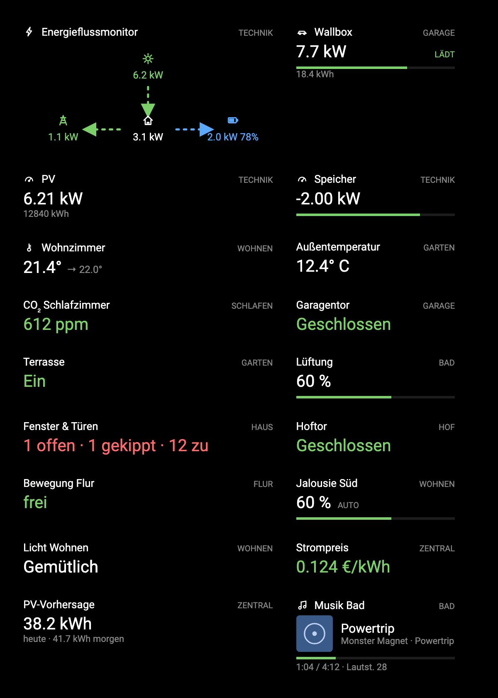
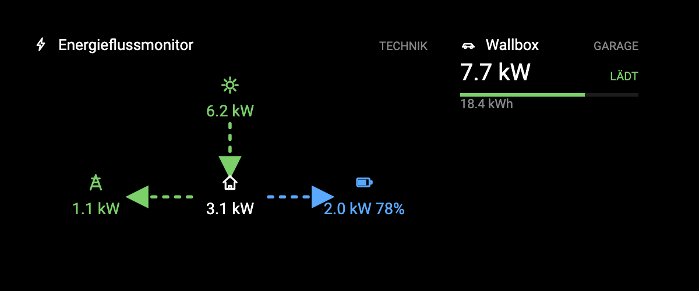
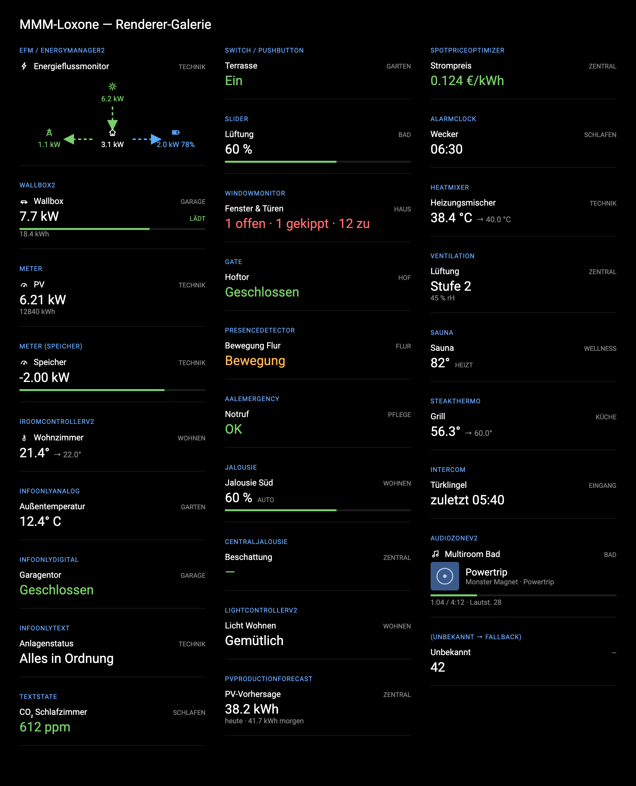

# MMM-Loxone

A [MagicMirror²](https://github.com/MichMich/MagicMirror/) module that connects to your Loxone Miniserver, subscribes to live control states, and displays them as a compact tile grid on the mirror. It is **read-only** — it displays state but sends no commands to the Miniserver.

## Preview



The **Energy-Flow Monitor** renders as a radial diagram — house in the centre, with production, grid and storage around it; arrow direction and colour follow the live energy flow (green = production/export, red = grid import, blue = storage). The **Wallbox** shows charging power, a progress bar and session energy:



> These are the actual renderers with sample data (Hybrid dark theme); the flow arrows animate in the live module. To preview locally **without a Miniserver**, serve the repo root with any static server (e.g. `python3 -m http.server`) and open `docs/preview/index.html`.

### Renderer gallery

Every supported control type, rendered with sample data (open `docs/preview/gallery.html` to see it live):



## Features

- Token-based authentication (no permanent credential storage; tokens refreshed automatically)
- Name-or-UUID control selection — identify controls, rooms, or categories by human-readable name or UUID
- Broad control support out of the box: **energy** (Energy-Flow EFM/EnergyManager2, Wallbox, Meter, PV forecast, spot price), **security & status** (window/door monitoring, gate, presence, emergency, status monitor), **shading & light** (blinds, light scenes), **climate** (room controller, heat mixer, ventilation, sauna), plus generic Info/Switch/Slider/TextState — see the [full table](#supported-controls). Unknown types fall back to a generic value renderer
- Hybrid dark theme with semantic color coding (green = production/export, red = import, blue = storage)
- Live state updates coalesced at a configurable throttle (default 250 ms)
- Automatic reconnection with exponential back-off

## Security

Please create a dedicated Loxone user for MagicMirror to keep your personal credentials secure.

## Installation

```shell
cd ~/MagicMirror/modules
git clone https://github.com/lucienkerl/MMM-Loxone
cd MMM-Loxone
npm install
```

## Update

```shell
cd ~/MagicMirror/modules/MMM-Loxone
git pull
npm install
```

## Configuration

Add the module to the `modules` array in `config/config.js`:

```js
{
    module: "MMM-Loxone",
    position: "bottom_left",
    config: {
        host: "192.168.0.46",       // Miniserver IP or CloudDNS address
        user: "mirror",
        password: "secret",

        // Select what to display — names or UUIDs; mix freely
        controls: ["PV-Anlage", "Wallbox Garage", "0d12f989-0060-c82f-ffff2083eaf2523c"],
        rooms: ["Wohnzimmer"],       // show all controls in these rooms
        categories: ["Energie"],    // show all controls in these categories
        hideEfmChildren: true,      // EFM shows only its first level; its sub-meters aren't duplicated as tiles

        // Layout
        layout: "grid",             // "grid" or "list"
        columns: 2,                 // columns when layout = "grid"
        showRoomLabels: true,       // show room name in tile header

        // Energy-Flow (EFM)
        efmLayout: "radial",        // currently only "radial"

        // Advanced
        updateThrottleMs: 250,      // batch state updates over this window
        permission: "app",          // Loxone token permission level
        reconnectMaxBackoffMs: 60000
    }
}
```

### Configuration options

| Option | Required | Default | Description |
|---|---|---|---|
| `host` | Yes | — | Miniserver IP or CloudDNS address |
| `user` | Yes | — | Loxone username |
| `password` | Yes | — | Loxone password |
| `controls` | No | `[]` | Names or UUIDs of specific controls to display |
| `rooms` | No | `[]` | Room names or UUIDs — all controls in these rooms are shown |
| `categories` | No | `[]` | Category names or UUIDs — all controls in these categories are shown |
| `hideEfmChildren` | No | `true` | Hide the meters an Energy-Flow Monitor is built from so it shows only its first-level flow (no duplicate sub-sensor tiles). Set `false` to show them. Controls you list explicitly in `controls` are always kept |
| `efmSocControl` | No | auto | Name/UUID of the control whose value is the battery state-of-charge shown on the EFM's storage node. Defaults to auto-detecting a single `EnergyManager2` |
| `layout` | No | `"grid"` | `"grid"` or `"list"` |
| `columns` | No | `2` | Number of grid columns |
| `showRoomLabels` | No | `true` | Show room name label in each tile header |
| `efmLayout` | No | `"radial"` | Energy-Flow layout; `"radial"` (radial SVG) |
| `updateThrottleMs` | No | `250` | State-update coalesce window in milliseconds |
| `permission` | No | `"app"` | Loxone token permission (`"app"` or `"web"`) |
| `reconnectMaxBackoffMs` | No | `60000` | Maximum reconnect back-off in milliseconds |

### Example configurations

**Minimal** — a handful of controls by name:

```js
config: {
    host: "192.168.0.46", user: "mirror", password: "secret",
    controls: ["Wallbox", "Energieflussmonitor", "Außentemperatur"]
}
```

**By room** — everything supported in selected rooms, three columns:

```js
config: {
    host: "dns.loxonecloud.com/504F94A0XXXX", user: "mirror", password: "secret",
    rooms: ["Technik", "Wohnzimmer"],
    columns: 3
}
```

**Energy dashboard** — curated list, no room labels:

```js
config: {
    host: "192.168.0.46", user: "mirror", password: "secret",
    controls: ["Energieflussmonitor", "Wallbox", "PV", "Speicher", "Netz"],
    layout: "list",
    showRoomLabels: false
}
```

If a name is ambiguous (the same name in several rooms) or not found, the module shows a small warning tile and keeps rendering the rest. Disambiguate with a room-qualified name (`"Technik/Wallbox"`) or the control's UUID.

## Supported controls

| Loxone type | Display |
|---|---|
| `EFM`, `EnergyManager2` | Energy-flow radial SVG (production, grid, storage + battery SoC, consumption). The EFM shows only its first-level balance; the meters it is built from are hidden by default — see `hideEfmChildren`. Battery SoC is pulled from an `EnergyManager2` (or `efmSocControl`) |
| `Wallbox2` | Charging power, progress bar, session energy, status badge |
| `Meter` | Power, cumulative energy, optional storage bar |
| `IRoomControllerV2` | Current and target temperature |
| `InfoOnlyAnalog` | Formatted numeric value |
| `InfoOnlyDigital` | On/off text with configurable color |
| `InfoOnlyText` | Raw text |
| `TextState` | Text with state color |
| `Switch`, `Pushbutton` | On/Off state |
| `Slider` | Value with progress bar |
| `WindowMonitor` | Open / tilted / closed counts, coloured by worst state |
| `Gate` | Garage/gate open or closed + position |
| `PresenceDetector` | Motion detected / clear |
| `AalEmergency` | Emergency-call alarm status |
| `Jalousie` | Blind position % + auto badge |
| `CentralJalousie` | Central shading status |
| `LightControllerV2` | Active light scene name |
| `PvProductionForecast` | PV forecast (today / tomorrow) |
| `SpotPriceOptimizer` | Current electricity price, coloured by level |
| `AlarmClock` | Next alarm time |
| `Heatmixer` | Heating flow temperature (actual → target) |
| `Ventilation` | Fan level + indoor humidity |
| `Sauna` | Temperature + ready/heating status |
| `SteakThermo` | Cooking-probe temperature (actual → target) |
| `Intercom` | Doorbell — ringing / last ring time |
| `StatusMonitor` | Fault count / OK |
| `AudioZoneV2` | Music-Server zone — cover, title, artist/album or radio station, play position + volume. Now-playing comes from a read-only second connection to the Loxone Audioserver (auto-discovered from the structure) |
| *(unknown)* | First available state value as text |

## License

MIT © David Gölzhäuser / Lucien Kerl
